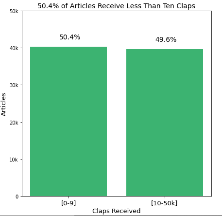

# Medium-Analysis

## What is Medium ?
Medium is the premier social blogging channel for first person storytelling and accounts of startup, entrepreneurial, VC and silicon valley tech news and debates. 
The content is fresh, contemporary, vulnerable and politically and socially charged representing one of the few Millennial social blogging networks worth following.
It allows content to be both easily created and consumed, and is strongly influenced by social media in terms of helping the content get distributed

## Objective:
* The purpose of this project was to give Medium writers a benchmark to measure their own performance, as well as a goal that might increase the rankings 
  of their stories in Medium's recommendation engine.
  
## Questions:
1. How many claps do Medium articles receive?
2. How long are Medium articles?
3. How many articles did we scrape from each tag?
4. What percent of authors have been published in a publication?
5. How many articles did most authors write?
6. Top 10 Most Prolific Authors ?
7. Total Claps Received?
8. Average claps per article?
9. Has an author written an exceptional article? (A different metric)
10. Which publications have the most authors?

**For more details please read the EDA notebook in repository**

## Scraping medium :
1. `To use this scraper to collect your own data, clone this repository to your local drive, then acquire a few more tools to make the scraper work.`
2. `First you will need to download the Chrome Driver and place it in the same directory as the "scrape_master.py" and "medium_scraper.py" files.
    You will also need the following Python libraries you will need: Selenium, Pandas, BeautifulSoup.`
3. `Before running "Scrape_master.py" enter the tags you want to scrape and put the start and end dates.`
4. `Run with "python scrape_master.py" make sure your are in same working directory`

## Results: 

**How many claps do Medium articles receive?**

**How long are Medium articles?**

**What percent of authors have been published in a publication?**

**Top 20 Consistent Authors with Highest Claps per Article**

